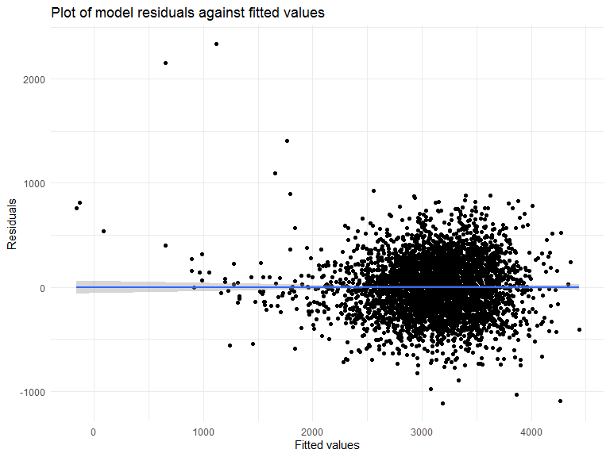
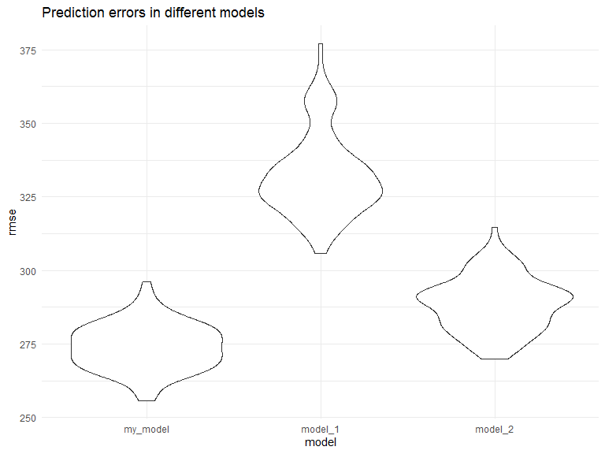
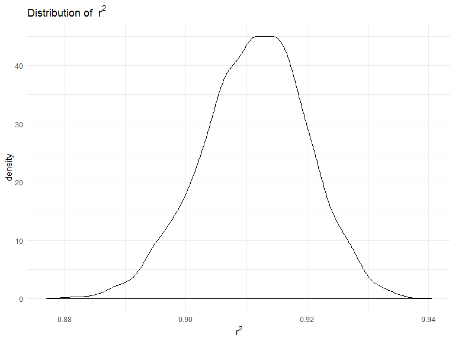
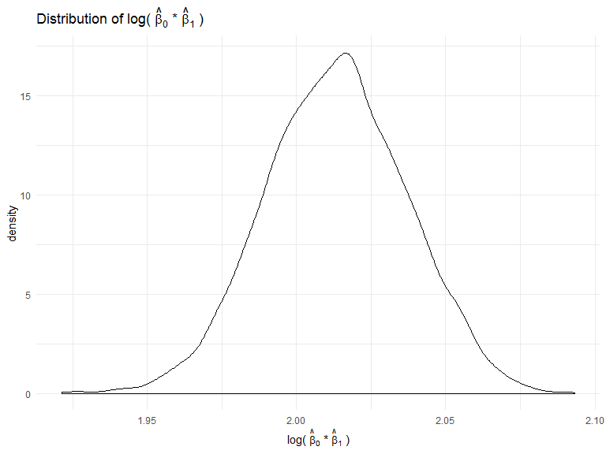

P8105 Homework 6
================
Junhui Mi
2019/11/24

# Problem 1

### Load and clean the data

``` r
birthweight = read_csv("./data/birthweight.csv") %>%
  janitor::clean_names() %>%
  mutate(babysex = factor(babysex, levels = c(1,2), labels = c("male", "female")),
         frace = factor(frace, levels = c(1,2,3,4,8,9), labels = c("white", "black", "asian", "puerto_rican", "other", "unknown")),
         malform = factor(malform, levels = c(0,1), labels = c("absent", "present")),
         mrace = factor(mrace, levels = c(1,2,3,4,8), labels = c("white", "black", "asian", "puerto_rican", "other")))
```

    ## Parsed with column specification:
    ## cols(
    ##   .default = col_double()
    ## )

    ## See spec(...) for full column specifications.

``` r
skimr::skim(birthweight)
```

    ## Skim summary statistics
    ##  n obs: 4342 
    ##  n variables: 20 
    ## 
    ## -- Variable type:factor --------------------------------------------------------
    ##  variable missing complete    n n_unique
    ##   babysex       0     4342 4342        2
    ##     frace       0     4342 4342        5
    ##   malform       0     4342 4342        2
    ##     mrace       0     4342 4342        4
    ##                               top_counts ordered
    ##              mal: 2230, fem: 2112, NA: 0   FALSE
    ##  whi: 2123, bla: 1911, pue: 248, asi: 46   FALSE
    ##                abs: 4327, pre: 15, NA: 0   FALSE
    ##  whi: 2147, bla: 1909, pue: 243, asi: 43   FALSE
    ## 
    ## -- Variable type:numeric -------------------------------------------------------
    ##  variable missing complete    n      mean     sd     p0     p25     p50
    ##     bhead       0     4342 4342   33.65     1.62  21      33      34   
    ##   blength       0     4342 4342   49.75     2.72  20      48      50   
    ##       bwt       0     4342 4342 3114.4    512.15 595    2807    3132.5 
    ##     delwt       0     4342 4342  145.57    22.21  86     131     143   
    ##   fincome       0     4342 4342   44.11    25.98   0      25      35   
    ##   gaweeks       0     4342 4342   39.43     3.15  17.7    38.3    39.9 
    ##  menarche       0     4342 4342   12.51     1.48   0      12      12   
    ##   mheight       0     4342 4342   63.49     2.66  48      62      63   
    ##    momage       0     4342 4342   20.3      3.88  12      18      20   
    ##    parity       0     4342 4342    0.0023   0.1    0       0       0   
    ##   pnumlbw       0     4342 4342    0        0      0       0       0   
    ##   pnumsga       0     4342 4342    0        0      0       0       0   
    ##     ppbmi       0     4342 4342   21.57     3.18  13.07   19.53   21.03
    ##      ppwt       0     4342 4342  123.49    20.16  70     110     120   
    ##    smoken       0     4342 4342    4.15     7.41   0       0       0   
    ##    wtgain       0     4342 4342   22.08    10.94 -46      15      22   
    ##      p75   p100     hist
    ##    35      41   ▁▁▁▁▅▇▁▁
    ##    51      63   ▁▁▁▁▁▇▁▁
    ##  3459    4791   ▁▁▁▃▇▇▂▁
    ##   157     334   ▁▇▅▁▁▁▁▁
    ##    65      96   ▁▂▇▂▂▂▁▃
    ##    41.1    51.3 ▁▁▁▁▃▇▁▁
    ##    13      19   ▁▁▁▁▂▇▁▁
    ##    65      77   ▁▁▁▅▇▂▁▁
    ##    22      44   ▂▇▅▂▁▁▁▁
    ##     0       6   ▇▁▁▁▁▁▁▁
    ##     0       0   ▁▁▁▇▁▁▁▁
    ##     0       0   ▁▁▁▇▁▁▁▁
    ##    22.91   46.1 ▁▇▅▁▁▁▁▁
    ##   134     287   ▁▇▆▁▁▁▁▁
    ##     5      60   ▇▁▁▁▁▁▁▁
    ##    28      89   ▁▁▁▇▇▁▁▁

The dataset contains 20 variables and 4342 observations. There is no
missing data.

### Propose a regression model

Bulid the model on a data-driven model-building process: First I put all
variables in my linear regression model.

``` r
birthweight %>%
  lm(bwt ~ babysex + bhead + blength + delwt + fincome + frace + gaweeks + malform + menarche + mheight + momage + mrace + parity + pnumlbw + pnumsga + ppbmi + ppwt + smoken + wtgain, data = .) %>% 
  broom::tidy() %>% 
  knitr::kable(digits = 3)
```

| term               |   estimate | std.error | statistic | p.value |
| :----------------- | ---------: | --------: | --------: | ------: |
| (Intercept)        | \-6265.391 |   660.401 |   \-9.487 |   0.000 |
| babysexfemale      |     28.707 |     8.465 |     3.391 |   0.001 |
| bhead              |    130.778 |     3.452 |    37.881 |   0.000 |
| blength            |     74.954 |     2.022 |    37.075 |   0.000 |
| delwt              |      4.101 |     0.395 |    10.386 |   0.000 |
| fincome            |      0.290 |     0.180 |     1.614 |   0.107 |
| fraceblack         |     14.331 |    46.150 |     0.311 |   0.756 |
| fraceasian         |     21.236 |    69.296 |     0.306 |   0.759 |
| fracepuerto\_rican |   \-46.996 |    44.678 |   \-1.052 |   0.293 |
| fraceother         |      4.297 |    74.074 |     0.058 |   0.954 |
| gaweeks            |     11.549 |     1.465 |     7.882 |   0.000 |
| malformpresent     |      9.765 |    70.626 |     0.138 |   0.890 |
| menarche           |    \-3.551 |     2.895 |   \-1.226 |   0.220 |
| mheight            |      9.787 |    10.312 |     0.949 |   0.343 |
| momage             |      0.759 |     1.222 |     0.621 |   0.534 |
| mraceblack         |  \-151.435 |    46.045 |   \-3.289 |   0.001 |
| mraceasian         |   \-91.387 |    71.919 |   \-1.271 |   0.204 |
| mracepuerto\_rican |   \-56.479 |    45.137 |   \-1.251 |   0.211 |
| parity             |     95.541 |    40.479 |     2.360 |   0.018 |
| ppbmi              |      4.354 |    14.891 |     0.292 |   0.770 |
| ppwt               |    \-3.472 |     2.612 |   \-1.329 |   0.184 |
| smoken             |    \-4.854 |     0.587 |   \-8.269 |   0.000 |

Using significance level alpha = 0.05, I choose variables with p-value
\< 0.05 and fit them in my model.

In my model, birthweight is associated with baby’s sex, baby’s head
circumference at birth, baby’s length at birth, mother’s weight at
delivery, gestational age, mother’s race, number of live births prior to
this pregnancy, and mother’s average number of cigarettes smoked per day
during pregnancy.

``` r
my_model = birthweight %>%
  lm(bwt ~ babysex + bhead + blength + delwt + gaweeks + mrace + parity + smoken, data = .)

birthweight %>%
  modelr::add_predictions(my_model) %>%
  modelr::add_residuals(my_model) %>%
  ggplot(aes(x = pred, y = resid)) +
  geom_point() + geom_smooth(method = lm) +
  labs(x = "Fitted values",
       y = "Residuals",
       title = "Plot of model residuals against fitted values")
```



Above is a plot of my model residuals against fitted values.

### Compare my model with other two model

``` r
model_1 = birthweight %>%
  lm(bwt ~ blength + gaweeks, data = .)

model_2 = birthweight %>%
  lm(bwt ~ babysex * bhead * blength, data = .)

cv_df = 
  crossv_mc(birthweight, 100) %>% 
  mutate(
    train = map(train, as_tibble),
    test = map(test, as_tibble)
    ) %>%
  mutate(
    my_model = map(train, ~ lm(bwt ~ babysex + bhead + blength + delwt + gaweeks + mrace + parity + smoken, data = .x)),
    model_1 = map(train, ~ lm(bwt ~ blength + gaweeks, data = .x)),
    model_2 = map(train, ~ lm(bwt ~ babysex * bhead * blength, data = .x))
    ) %>% 
  mutate(
    rmse_my_model = map2_dbl(my_model, test, ~ rmse(model = .x, data = .y)),
    rmse_model_1 = map2_dbl(model_1, test, ~ rmse(model = .x, data = .y)),
    rmse_model_2 = map2_dbl(model_2, test, ~ rmse(model = .x, data = .y)))

cv_df %>% 
  select(starts_with("rmse")) %>% 
  pivot_longer(
    everything(),
    names_to = "model", 
    values_to = "rmse",
    names_prefix = "rmse_") %>% 
  mutate(model = fct_inorder(model)) %>% 
  ggplot(aes(x = model, y = rmse)) + geom_violin()  +
  labs(title = "Prediction errors in different models")
```



From the plot above we can see that my model has the least RMSE. My
model is the best among three models, model\_2 ranks second and model\_1
ranks third.

# Problem 2

### Load data

``` r
weather_df = 
  rnoaa::meteo_pull_monitors(
    c("USW00094728"),
    var = c("PRCP", "TMIN", "TMAX"), 
    date_min = "2017-01-01",
    date_max = "2017-12-31") %>%
  mutate(
    name = recode(id, USW00094728 = "CentralPark_NY"),
    tmin = tmin / 10,
    tmax = tmax / 10) %>%
  select(name, id, everything())
```

    ## Registered S3 method overwritten by 'crul':
    ##   method                 from
    ##   as.character.form_file httr

    ## Registered S3 method overwritten by 'hoardr':
    ##   method           from
    ##   print.cache_info httr

    ## file path:          C:\Users\ThinkPad\AppData\Local\rnoaa\rnoaa\Cache/ghcnd/USW00094728.dly

    ## file last updated:  2019-09-26 10:52:02

    ## file min/max dates: 1869-01-01 / 2019-09-30

### Bootstrap

``` r
weather_bootstrap = weather_df %>% 
  modelr::bootstrap(n = 5000) %>% 
  mutate(
    models = map(strap, ~ lm(tmax ~ tmin, data = .x)),
    results_1 = map(models, broom::glance),
    results_2 = map(models, broom::tidy),
    r_squared = map_dbl(.x = results_1, ~.x %>% pull(r.squared)),
    log_b0_b1 = map_dbl(.x = results_2, ~.x %>% pull(estimate) %>% prod %>% log)) %>%
  select(.id, r_squared, log_b0_b1)
```

### Distribution of two estimated quantities

``` r
weather_bootstrap %>%
  ggplot(aes(x = r_squared)) + geom_density() +
  labs(x = expression(""~r^2~""),
       title = expression("Distribution of "~r^2~""))
```



``` r
weather_bootstrap %>%
  ggplot(aes(x = log_b0_b1)) + geom_density() +
  labs(x = expression("log("~hat(beta)[0]~"*"~hat(beta)[1]~")"),
       title = expression("Distribution of log("~hat(beta)[0]~"*"~hat(beta)[1]~")"))
```



The distribution of r\_squared is a little left-skewed normal with mean
around 0.91, and the distribution of log\_b0\_b1 is a little left-skewed
normal with mean around 2.02.

### Confidence Interval of estimates

``` r
weather_bootstrap %>%
  pivot_longer(
    -.id,
    names_to = "estimates",
    values_to = "value"
    ) %>%
  group_by(estimates) %>%
  summarize(quantile2.5 = round(quantile(value,0.025), digits = 3),
            quantile97.5 = round(quantile(value,0.975), digits = 3)) %>%
  mutate(CI = str_c(quantile2.5, quantile97.5, sep = ",")) %>%
  knitr::kable(caption = "95% CI of estimates", format = "html", digits = 3)
```

<table>

<caption>

95% CI of estimates

</caption>

<thead>

<tr>

<th style="text-align:left;">

estimates

</th>

<th style="text-align:right;">

quantile2.5

</th>

<th style="text-align:right;">

quantile97.5

</th>

<th style="text-align:left;">

CI

</th>

</tr>

</thead>

<tbody>

<tr>

<td style="text-align:left;">

log\_b0\_b1

</td>

<td style="text-align:right;">

1.967

</td>

<td style="text-align:right;">

2.059

</td>

<td style="text-align:left;">

1.967,2.059

</td>

</tr>

<tr>

<td style="text-align:left;">

r\_squared

</td>

<td style="text-align:right;">

0.894

</td>

<td style="text-align:right;">

0.927

</td>

<td style="text-align:left;">

0.894,0.927

</td>

</tr>

</tbody>

</table>

The 95% confidence interval of log\_b0\_b1 is (1.966,2.058), and
(0.894,0.927) for r\_squared.
